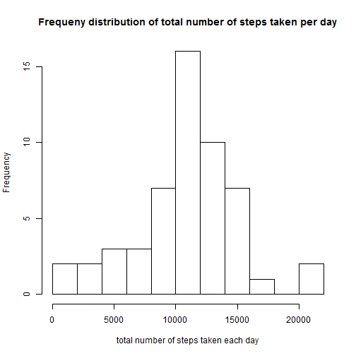

# Reproducible Research: Peer Assessment 1
This report describes the steps to carry out the analysis of personal activity data collected from an anonymous individual over a period of **2 months (October and November, 2012)**.

## Loading and preprocessing the data
The activity data is read into R using the read.csv function and taking a look at the structure of the data frame, we see that the data has **17568** observations and **3** columns. The three columns which are **steps**, **date** and **interval** are of class *"integer"*, *"factor"* and *"integer"* respectivley.

The interval variable is set properly to reflect selected **5 minutes** time intervals in a day. 


```r
unzip("activity.zip")
personalActvyData <- read.csv("activity.csv")
str(personalActvyData)
```

```
## 'data.frame':	17568 obs. of  3 variables:
##  $ steps   : int  NA NA NA NA NA NA NA NA NA NA ...
##  $ date    : Factor w/ 61 levels "2012-10-01","2012-10-02",..: 1 1 1 1 1 1 1 1 1 1 ...
##  $ interval: int  0 5 10 15 20 25 30 35 40 45 ...
```

```r
personalActvyData$interval <- sprintf("%04.f", personalActvyData$interval)
personalActvyData$interval <- with(personalActvyData, paste(substr(interval, 
    1, 2), substr(interval, 3, 4), sep = ":"))
head(personalActvyData)
```

```
##   steps       date interval
## 1    NA 2012-10-01    00:00
## 2    NA 2012-10-01    00:05
## 3    NA 2012-10-01    00:10
## 4    NA 2012-10-01    00:15
## 5    NA 2012-10-01    00:20
## 6    NA 2012-10-01    00:25
```


The data is in a good format and analysis can commence.

## What is mean total number of steps taken per day?
In order to visualize and estimate the mean total number of steps taken per day, the data frame was aggregated by *"day"* (ignoring the missing values) as follows:


```r
totalPersonalActvyData <- with(na.omit(personalActvyData), aggregate(steps, 
    list(date), sum))
```


Then a histogram of the total number of steps taken each day was created:


```r
hist(totalPersonalActvyData$x, xlab = "total number of steps taken each day", 
    10, main = "Frequeny distribution of total number of steps taken per day")
```

 


and followed by its summary which shows the mean and the median:


```r
totalStepsPerDay <- totalPersonalActvyData$x
summary(totalStepsPerDay)
```

```
##    Min. 1st Qu.  Median    Mean 3rd Qu.    Max. 
##      41    8840   10800   10800   13300   21200
```


The  mean and median total number of steps taken per day are same here and they are both  10800

## What is the average daily activity pattern?

```r
avgStepsPer5mins <- with(na.omit(personalActvyData), aggregate(steps, list(interval), 
    mean))

avgStepsPer5mins$Group.1 <- strptime(avgStepsPer5mins$Group.1, format = "%H:%M")

plot(avgStepsPer5mins, type = "l", xlab = "5-minute interval", ylab = "average number of steps taken across all days", 
    main = "Time series plot of 5-minute interval average step across all days")
```

 


The 5-minute interval which on average across all the days in the dataset that contains the maximum number of steps is about 8:30-8:35am.

## Imputing missing values
The total number of rows with missing data is:

```r
length(which(is.na(personalActvyData$steps)))
```

```
## [1] 2304
```


The missing values are replaced by the daily mean. Where all the values for a whole day are missing, the NA values are replaced with *0* since there does not exist values to average over. This can be achieved using the **"NAFillerFunction"** function below:


```r
NAFillerFunction <- function(my.data) {
    # This function fills missing values of steps at different intervals with
    # it's daily mean and where all values for a whole day are missing, then it
    # sets the missing value to 0
    
    # Input: A data frame called 'my.data' with steps, date and interval as
    # columns Output: The data frame supplied but with filled missing values for
    # steps
    
    if (missing(my.data)) {
        stop("my.data is not supplied")
    }
    if (is.null(dim(my.data))) {
        stop("my.data must be a data frame")
    }
    if (any(!(c("steps", "date") %in% tolower(names(my.data))))) {
        stop("incorrect column names of my.data")
    }
    
    steps.xts <- with(my.data, xts::xts(steps, as.Date(date)))
    dailyMeans <- xts::apply.daily(steps.xts, mean)
    dailyMeans[, 1] <- ifelse(is.na(dailyMeans[, 1]), 0, dailyMeans[, 1])
    zVector <- as.vector(steps.xts)
    names(zVector) <- zoo::index(steps.xts)
    dailyMeansVector <- as.vector(dailyMeans)
    names(dailyMeansVector) <- zoo::index(dailyMeans)
    zVector <- ifelse(is.na(zVector), dailyMeansVector[names(zVector)], zVector)
    my.data$steps <- zVector
    my.data
}

adjustedPersonalActvyData <- NAFillerFunction(personalActvyData)
```


The histogram of the total number of steps taken each day is given below:

fistly aggregating the data by **"day"** and plotting:

```r
totalAdjustedPersonalActvyData <- with(adjustedPersonalActvyData, aggregate(steps, 
    list(date), sum))
hist(totalAdjustedPersonalActvyData$x, xlab = "total number of steps taken each day", 
    10, main = "Frequeny distribution of total number of steps taken per day (NA adjusted)")
```

 


and then summarizing:

```r
summary(totalAdjustedPersonalActvyData$x)
```

```
##    Min. 1st Qu.  Median    Mean 3rd Qu.    Max. 
##       0    6780   10400    9350   12800   21200
```

the mean and median are   9350 and  10400 respectively.

Putting the plots side by side


```r
op <- par(mfrow = c(1, 2), cex = 0.75)
hist(totalPersonalActvyData$x, xlab = "total number of steps taken each day", 
    10, main = "Distribution of total number of steps taken per day")
hist(totalAdjustedPersonalActvyData$x, xlab = "total number of steps taken each day", 
    10, main = "Distribution of total number of steps taken per day (NA adjusted)")
```

 

```r
par(op)
```


Putting the summary values side by side,


```r
rbind(withNA = summary(totalStepsPerDay), withoutNA = summary(totalAdjustedPersonalActvyData$x))
```

```
##           Min. 1st Qu. Median  Mean 3rd Qu.  Max.
## withNA      41    8840  10800 10800   13300 21200
## withoutNA    0    6780  10400  9350   12800 21200
```


and comparing the mean and median for the two cases, there is difference between this result with the NA's adjusted for and the one with NA's unadjusted for. 

The impact the NA adjustment has on the mean and median is that it reduces them.

## Are there differences in activity patterns between weekdays and weekends?
Creating the new factor variable in the dataset with two levels- "weekday"" and "weekend":

```r
newWeekDay <- weekdays(as.Date(adjustedPersonalActvyData$date))
newWeekDay <- ifelse(newWeekDay %in% c("Monday", "Tuesday", "Wednesday", "Thursday", 
    "Friday"), "Weekday", "Weekend")
newWeekDay <- factor(newWeekDay)
adjustedPersonalActvyDatabyWeekPeriod <- data.frame(adjustedPersonalActvyData, 
    WeekPeriod = newWeekDay)
head(adjustedPersonalActvyDatabyWeekPeriod)
```

```
##   steps       date interval WeekPeriod
## 1     0 2012-10-01    00:00    Weekday
## 2     0 2012-10-01    00:05    Weekday
## 3     0 2012-10-01    00:10    Weekday
## 4     0 2012-10-01    00:15    Weekday
## 5     0 2012-10-01    00:20    Weekday
## 6     0 2012-10-01    00:25    Weekday
```


and creating the panel plot:


```r
newWeekPeriodData <- with(adjustedPersonalActvyDatabyWeekPeriod, aggregate(steps, 
    list(interval, WeekPeriod), mean))
weekDayData <- subset(newWeekPeriodData, Group.2 == "Weekday", select = c(Group.1, 
    x))
weekEndData <- subset(newWeekPeriodData, Group.2 == "Weekend", select = c(Group.1, 
    x))
op <- par(mfcol = c(2, 1), oma = c(1, 1, 1, 1))
with(weekDayData, plot(strptime(Group.1, format = "%H:%M"), x, type = "l", xlab = "5-mins interval (weekday)", 
    ylab = "average number of steps"))
with(weekEndData, plot(strptime(Group.1, format = "%H:%M"), x, type = "l", xlab = "5-mins interval (weekend)", 
    ylab = "average number of steps"))
```

 

```r
par(op)
```


